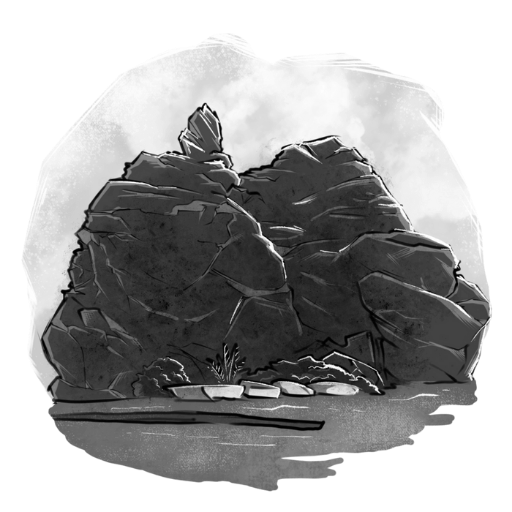

# Melicena Web Page

Web Site about small village in the South of Spain! Deploy [here for Vercel](https://melicena-nextjs.vercel.app/) and [here for live](https://www.melicena.es).

## 👩‍🎨 Design

Please, find the design [here](https://www.figma.com/file/aWT1yxLYQEAobgtwThy786/Melicena?type=design&node-id=0-1&mode=design&t=ByAELWdKCJRW3neO-0).

Texts will be delivered on the fly 🪰.

## 💪 Tasks:

To Do

- [x] - Create the Hero Component (with text, subtitle, body and cta on the left, and image on the right)
- [x] - Create the textImage Component (with the possibility of reverting direction with props)
- [x] - Create the section regarding the Place of interests
- [x] - Create the section regarding the festivities
- [ ] - Improve the banner section, if required
- [x] - Improve the footer section, if required
- [x] - Create the og graphs for better sharing of the page
  

Nice to have

- [ ] - Create a second page with a Masonry Layout full of cool pictures of the village (we would need to keep them stored somewhere with the copyright for the figcaption)
- [ ] - Create the quiz page following basically what I did on https://github.com/manuelsanchezweb/zustand-react-typescript-quiz + also adding supabase integration. This a big todo.
- [ ] - Create the contact section, we can use https://formspree.io/f/mayaebzj as the action of the form, and I will automatically receive emails with the information.
- [x] - Add animations or transitions to the page
  

## Contact

- [Manuel Sánchez](https://github.com/manuelsanchezweb)
- [Lara Bucher](https://github.com/BucherLara)
